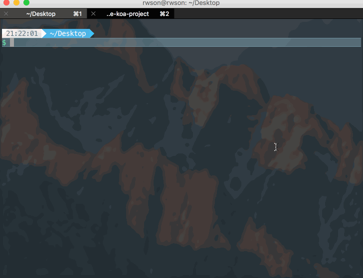

# create-koa-project

a command line tool to create koa application quickly


#### screenshot




#### usage

```bash
npm install create-koa-project -g
```

```bash
create-koa-project <your-koa-project-name>
```

happy coding 😄